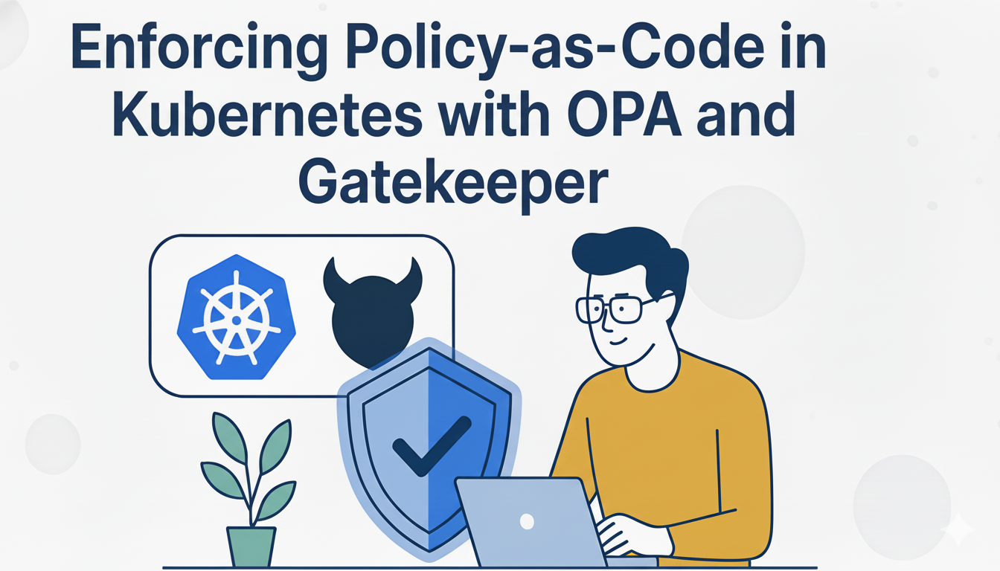
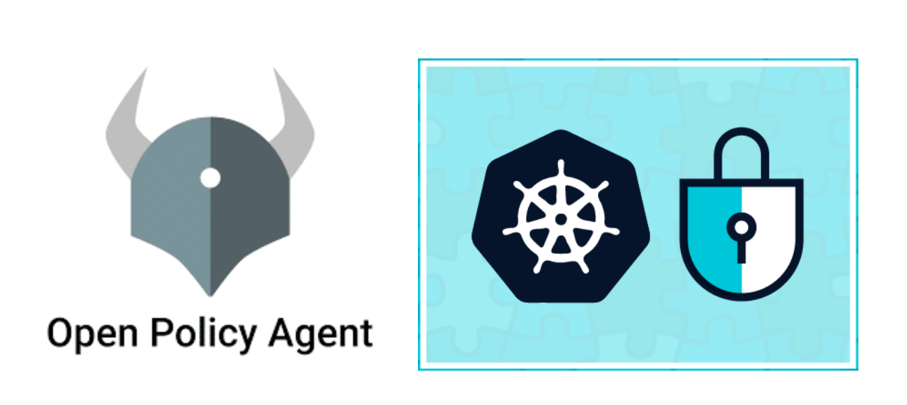

# 🔐 Enforcing Policy-as-Code in Kubernetes with OPA and Gatekeeper 



🚨 La sécurité ne doit jamais être une réflexion de dernière minute — c’est la véritable armure 🦾 de ton application.

🔐 Il est essentiel d’intégrer dès le départ des principes tels que :

🧱 Zero Trust – Ne fais confiance à rien, vérifie tout.

⚖️ Moindre privilège – Donne uniquement les accès nécessaires.

🧬 Secure by Design – Pense sécurité dès la conception.

🚀 L’un des meilleurs moyens d’appliquer ces principes dans Kubernetes est d’utiliser :

🧠 Open Policy Agent (OPA) – pour définir des politiques de sécurité sous forme de code.

🧩 Gatekeeper – pour les faire respecter automatiquement dans ton cluster.

📜 Ensemble, ils te permettent de mettre en place une approche Policy-as-Code, garantissant que ton cluster reste sûr, cohérent et conforme à chaque déploiement.

# ⚙️ Mise en place dans ton environnement Kubernetes

🧠 Open Policy Agent (OPA) est un moteur de politiques généraliste.
Tu écris tes règles dans un langage déclaratif de haut niveau appelé Rego.
OPA évalue ces politiques et renvoie des décisions allow/deny (autoriser/refuser) ou des données structurées selon les règles définies.

🧩 Gatekeeper, quant à lui, est une extension native Kubernetes basée sur OPA.
Il ne fait pas partie du noyau Kubernetes, mais il s’appuie sur OPA pour faire respecter les politiques “as code” lors de la création ou de la mise à jour des ressources du cluster.

🔄 En résumé :

⚙️ OPA = le moteur qui évalue les politiques.

🚦 Gatekeeper = le contrôleur Kubernetes qui applique ces politiques en temps réel.

💪 Ensemble, ils te permettent d’apporter une couche de sécurité dynamique et automatisée à ton cluster Kubernetes.


# 📝 Prérequis
Avant de commencer, assurez-vous de disposer d’un cluster Kubernetes fonctionnel.

Si vous n’en avez pas encore :

Vous pouvez lancer  :

**💻 Via script shell prêt à l’emploi :**

````
cd cluster-k8s-shell
. create-cluster.sh
````

Ou si vous préférez créer le cluster via Ansible, utilisez :

**⚙️ Via Ansible :**
````
cd cluster-k8s-ansible/cluster-k8s
ansible-playbook -i inventory.ini site.yml

````

# 🛠️ Étape par étape : Configurer OPA dans Kubernetes avec Gatekeeper 


**🔹 Étape 1 : Installer Gatekeeper (OPA pour Kubernetes)**

```
kubectl apply -f https://raw.githubusercontent.com/open-policy-agent/gatekeeper/release-3.14/deploy/gatekeeper.yaml
```

**Vérifie que les pods sont bien en cours d’exécution :**

````
kubectl get pods -n gatekeeper-system
````


 **🔹Étape 2 : Définir un ConstraintTemplate**

 🔧 Cette étape permet de créer une politique 🧩 indiquant que les conteneurs 🚫 ne doivent pas s’exécuter avec l’utilisateur root 👑.

 ````
 sudo nano constrainttemplate-runasnonroot.yaml   
 ````
 
 et copie ce contenu 


````
apiVersion: templates.gatekeeper.sh/v1beta1  
kind: ConstraintTemplate  
metadata:   
   name: k8spsprestrictrunasroot  
spec:   
   crd:     
      spec:       
         names:         
            kind: K8sPSPRestrictRunAsRoot   
targets:     
   - target: admission.k8s.gatekeeper.sh       
   rego: |         
      package k8spsprestrictrunasroot           

      violation[{"msg": msg}] {           
         container := input.review.object.spec.containers[_]           
         not container.securityContext.runAsNonRoot           
         msg := sprintf("Container '%v' is running as root, which is not allowed.",       [container.name])        
    } 
````

**🔹 Étape 3 : Appliquer une Constraint (Faire respecter la politique) ⚡**

````
sudo nano constraint-runasnonroot.yaml
````
Copie ce contenu maintenant 
````
apiVersion: constraints.gatekeeper.sh/v1beta1  
kind: K8sPSPRestrictRunAsRoot  
metadata:   
   name: restrict-containers-from-running-as-root  
spec:   
   match:     
      kinds:       
         - apiGroups: [""]         
           kinds: ["Pod"] 


 ````

 **🚀 Déployer les deux :**          

 ````
kubectl apply -f constrainttemplate-runasnonroot.yaml  
kubectl apply -f constraint-runasnonroot.yaml 
````

**🔹 Étape 4 : Tester la politique 🧪**

⚠️ Essayez de déployer un pod non conforme 🚫

````
apiVersion: v1  
kind: Pod  
metadata:   
  name: test-bad-pod  
spec:   
  containers:   
    - name: nginx     
      image: nginx 

````


▶️ Exécutez-le

````
kubectl apply -f test-bad-pod.yaml 
````

**✅ Résultat attendu**

Le déploiement est refusé avec une erreur du type : ⚠️

````
Container 'nginx' is running as root, which is not allowed. 
````

**🔹 Étape 5 : Auditer les ressources existantes 🕵️‍♂️**

OPA Gatekeeper prend en charge le mode audit, ce qui permet de détecter les mauvaises configurations des ressources déjà en fonctionnement sans les bloquer.

````
kubectl get constrainttemplates  
kubectl get k8spsprestrictrunasroot 
````

# 🔹 Autres politiques mises en place 🛡️

En plus de la règle “pas de conteneurs root”, d’autres politiques ont été configurées pour renforcer la sécurité du cluster :

🚫 Interdire l’utilisation de NodePort pour limiter l’exposition directe des services.

🆕 Ne pas utiliser l’image latest pour garantir des versions stables et prévisibles des conteneurs.

🔒 Interdire les conteneurs privilégiés pour réduire les risques d’élévation de privilèges.

📏 Appliquer des limites de ressources (CPU et mémoire) pour tous les pods afin de prévenir la surconsommation et assurer la stabilité du cluster.


🎯 Vous avez maintenant OPA Gatekeeper opérationnel et plusieurs politiques appliquées ! 
Vous pouvez créer de nouvelles policies selon vos besoins.

