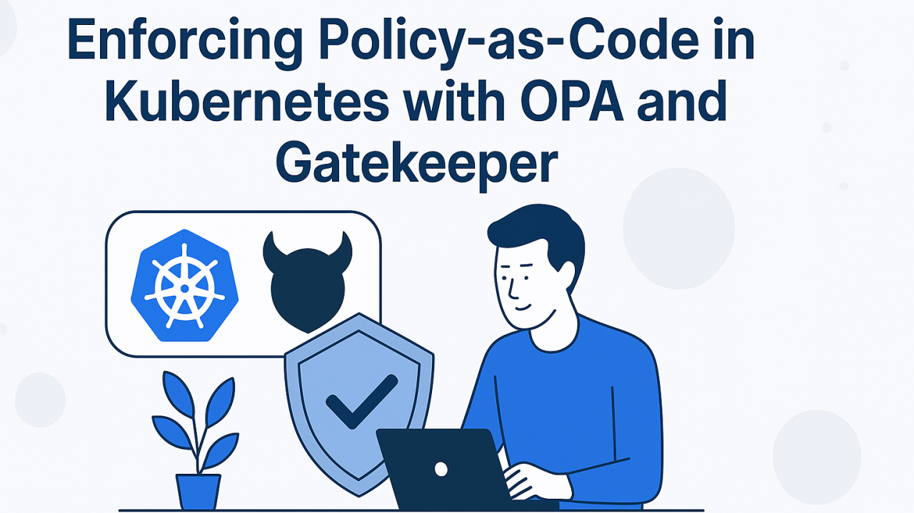
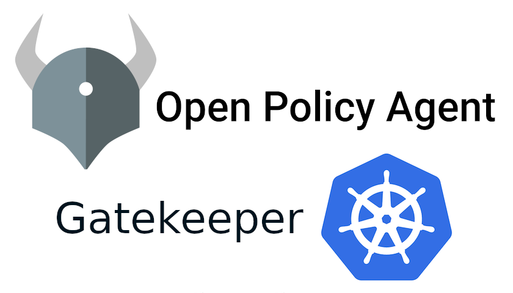

# 🔐 Enforcing Policy-as-Code in Kubernetes with OPA and Gatekeeper 



🚨 La sécurité ne doit jamais être une réflexion de dernière minute — c’est la véritable armure 🦾 de ton application.

🔐 Il est essentiel d’intégrer dès le départ des principes tels que :

🧱 Zero Trust – Ne fais confiance à rien, vérifie tout.

⚖️ Moindre privilège – Donne uniquement les accès nécessaires.

🧬 Secure by Design – Pense sécurité dès la conception.

🚀 L’un des meilleurs moyens d’appliquer ces principes dans Kubernetes est d’utiliser :

🧠 Open Policy Agent (OPA) – pour définir des politiques de sécurité sous forme de code.

🧩 Gatekeeper – pour les faire respecter automatiquement dans ton cluster.

📜 Ensemble, ils te permettent de mettre en place une approche Policy-as-Code, garantissant que ton cluster reste sûr, cohérent et conforme à chaque déploiement.

# ⚙️ Mise en place dans ton environnement Kubernetes

🧠 Open Policy Agent (OPA) est un moteur de politiques généraliste.
Tu écris tes règles dans un langage déclaratif de haut niveau appelé Rego.
OPA évalue ces politiques et renvoie des décisions allow/deny (autoriser/refuser) ou des données structurées selon les règles définies.

🧩 Gatekeeper, quant à lui, est une extension native Kubernetes basée sur OPA.
Il ne fait pas partie du noyau Kubernetes, mais il s’appuie sur OPA pour faire respecter les politiques “as code” lors de la création ou de la mise à jour des ressources du cluster.

🔄 En résumé :

⚙️ OPA = le moteur qui évalue les politiques.

🚦 Gatekeeper = le contrôleur Kubernetes qui applique ces politiques en temps réel.

💪 Ensemble, ils te permettent d’apporter une couche de sécurité dynamique et automatisée à ton cluster Kubernetes.



# 🛠️ Étape par étape : Configurer OPA dans Kubernetes avec Gatekeeper 


**🔹 Étape 1 : Installer Gatekeeper (OPA pour Kubernetes)**

```
kubectl apply -f https://raw.githubusercontent.com/open-policy-agent/gatekeeper/release-3.14/deploy/gatekeeper.yaml
```

**Vérifie que les pods sont bien en cours d’exécution :**

````
kubectl get pods -n gatekeeper-system
````


 **🔹Étape 2 : Définir un ConstraintTemplate**

 🔧 Cette étape permet de créer une politique 🧩 indiquant que les conteneurs 🚫 ne doivent pas s’exécuter avec l’utilisateur root 👑.

````
kubectl get pods -n gatekeeper-system
````

    __🔹 Étape 3 : Appliquer une Constraint (Faire respecter la politique) ⚡__


